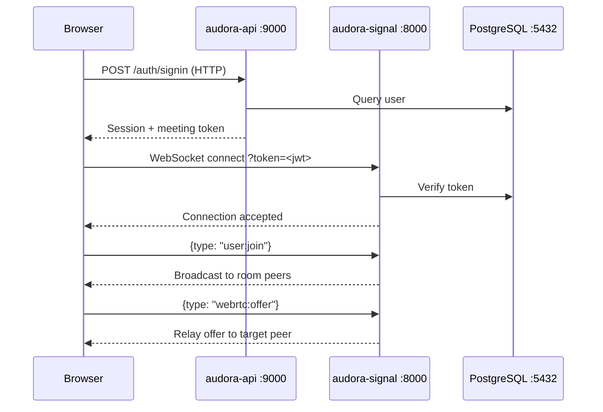
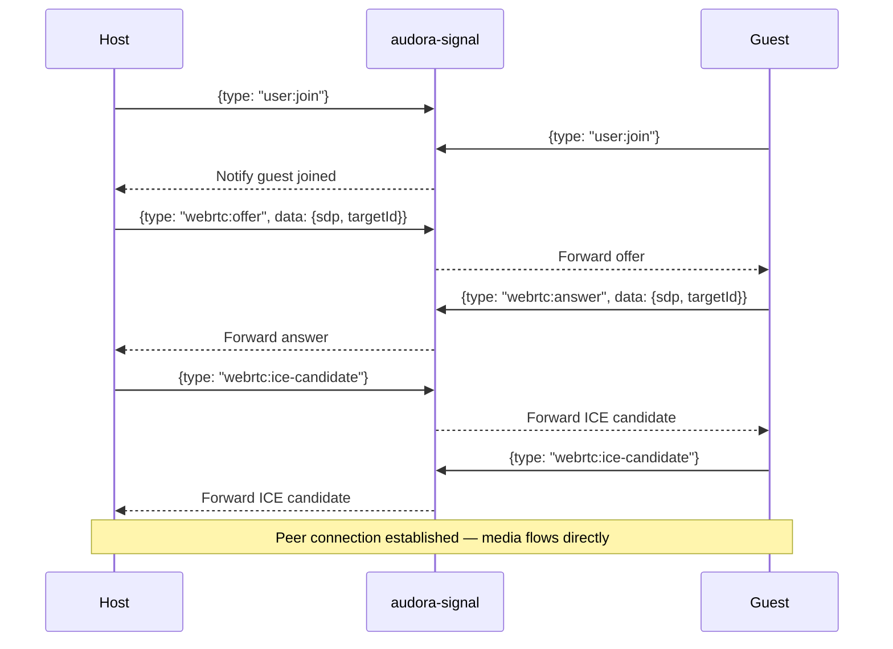

Audora is a Turborepo monorepo. All applications and shared packages live in the same repository, share a single `bun install` lockfile, and are built and tested together through Turborepo's task pipeline.

## Repository structure

```text
audora/
├── apps/
│   ├── audora-frontend/       # Next.js 16 app (port 3000)
│   ├── audora-api/            # Express 5 / Bun REST API (port 9000)
│   └── audora-signal/         # ws WebSocket signaling server (port 8000)
├── packages/
│   ├── database/              # Prisma schema, migrations, generated client
│   ├── types/                 # Shared TypeScript types (InboundMessage etc.)
│   ├── ui/                    # Shared React UI components
│   └── typescript-config/     # Base tsconfig.json
├── docker/
│   ├── backend.prod.Dockerfile
│   ├── frontend.prod.Dockerfile
│   └── signal.prod.Dockerfile
├── .github/workflows/         # GitHub Actions CI/CD
├── docker-compose.yaml        # Full-stack Docker Compose
├── turbo.json                 # Turborepo task pipeline
└── package.json               # Root workspace manifest
```

Bun workspaces wire every `apps/*` and `packages/*` directory together. Apps depend on shared packages using `"*"` version references (e.g. `"@audora/database": "*"`) which Bun resolves within the workspace.

## Three-service architecture

<CardGroup cols={3}>
  <Card title="audora-frontend" icon="monitor" href="/introduction#audora-frontend">
    Next.js 16 · React 19 · Tailwind CSS 4

    Serves the host dashboard and guest recording studio. Calls the API over HTTP and connects to the signal server over WebSocket.

    **Port 3000**
  </Card>
  <Card title="audora-api" icon="server" href="/introduction#audora-api">
    Express 5 · Bun runtime

    REST API for auth, studio management, project/track CRUD, meeting tokens, and recording metadata.

    **Port 9000**
  </Card>
  <Card title="audora-signal" icon="wifi" href="/introduction#audora-signal">
    ws · Bun runtime

    WebSocket server that relays WebRTC signaling messages and room events between peers.

    **Port 8000 (WS) · 8001 (health)**
  </Card>
</CardGroup>

### How the services communicate



The frontend never establishes a direct connection between audora-api and audora-signal. Both services share the same `DATABASE_URL` and `NEXTAUTH_SECRET`, allowing the signal server to independently verify the JWT tokens issued by the API.

## WebRTC signaling flow

The signal server acts as a relay — it never processes media. Its only job is to route WebRTC negotiation messages between peers in the same room.



The full set of message types handled by the signal server:

| Category | Message types |
|---|---|
| Room events | `user:join`, `user:leave`, `meeting:end` |
| WebRTC negotiation | `webrtc:offer`, `webrtc:answer`, `webrtc:ice-candidate` |
| Studio controls | `mic:toggle`, `cam:toggle` |
| Recording lifecycle | `project-id`, `track-id`, `recording:start`, `recording:stop` |

<Note>
  The signal server exposes an HTTP health-check endpoint at `http://localhost:8001/health` (port 8001). Docker Compose uses this endpoint to determine service readiness before starting the frontend container.
</Note>

## Data model

All persistent state is stored in PostgreSQL and accessed through the shared `@audora/database` package (Prisma 6).

The entity hierarchy is: **User → Studio → Project → Track → Recording**.

```prisma
model User {
  id        String   @id @default(uuid())
  name      String
  email     String   @unique
  password  String?
  image     String?
  provider  String   @default("credentials")
  createdAt DateTime @default(now())
  updatedAt DateTime @updatedAt

  studio Studio? @relation("UserStudio")
}

model Studio {
  id         String @id @default(uuid())
  studioSlug String @unique
  studioName String
  token      String @unique @default(cuid())

  // Recording settings
  recordingType            RecordingType   @default(VIDEO_AUDIO)
  audioSampleRate          AudioSampleRate @default(KHZ_44_1)
  videoQuality             VideoQuality    @default(STANDARD)
  enableLobby              Boolean         @default(false)
  enableCaptions           Boolean         @default(false)
  noiseReduction           Boolean         @default(false)
  countdownBeforeRecording Boolean         @default(false)
  autoStartOnGuestJoin     Boolean         @default(false)
  pauseUploads             Boolean         @default(false)
  language                 String          @default("English")

  user     User      @relation("UserStudio", fields: [userId], references: [id], onDelete: Cascade)
  userId   String    @unique
  projects Project[] @relation("StudioProject")
}

model Project {
  id        String   @id @default(uuid())
  title     String
  studioId  String
  createdAt DateTime @default(now())

  studio Studio  @relation("StudioProject", fields: [studioId], references: [id], onDelete: Cascade)
  tracks Track[] @relation("ProjectTrack")
}

model Track {
  id             String   @id @default(uuid())
  name           String?
  projectId      String
  mergedVideoUrl String?
  createdAt      DateTime @default(now())

  project    Project     @relation("ProjectTrack", fields: [projectId], references: [id])
  recordings Recording[] @relation("RecordingTrack")
}

model Recording {
  id           String          @id @default(uuid())
  trackId      String
  displayName  String
  videoUrl     String?
  duration     Int?
  resolution   String?         @default("1280x720")
  thumbnailUrl String?
  status       RecordingStatus @default(RECORDING)
  createdAt    DateTime        @default(now())

  track Track @relation("RecordingTrack", fields: [trackId], references: [id])
}
```

### Entity relationships

- Each **User** owns exactly one **Studio** (one-to-one, cascade delete).
- A **Studio** holds many **Projects** (one-to-many).
- A **Project** contains many **Tracks** — one per recording participant in a session.
- A **Track** accumulates many **Recordings** — individual takes or upload chunks.
- A **Recording** transitions through the `RecordingStatus` lifecycle: `RECORDING` → `MERGING` → `COMPLETED` (or `FAILED`).

### Studio settings enums

| Enum | Values |
|---|---|
| `RecordingType` | `VIDEO_AUDIO`, `AUDIO_ONLY` |
| `AudioSampleRate` | `KHZ_44_1` (44.1 kHz), `KHZ_48` (48 kHz) |
| `VideoQuality` | `STANDARD`, `ADVANCED` |
| `RecordingStatus` | `RECORDING`, `MERGING`, `COMPLETED`, `FAILED` |

## Turborepo task pipeline

The `turbo.json` file defines how tasks depend on each other across packages.

```json
{
  "tasks": {
    "build": { "dependsOn": ["^build"] },
    "start:api": { "dependsOn": ["^db:deploy"] },
    "start:signal": { "dependsOn": ["^db:deploy"] },
    "db:deploy": { "cache": false, "env": ["DATABASE_URL"] }
  }
}
```

`^build` means "build all workspace dependencies first". `start:api` and `start:signal` both declare a dependency on `^db:deploy`, so Turborepo always applies migrations before starting either server.

## Docker Compose topology

The `docker-compose.yaml` file defines four services with explicit health-check dependencies.

```text
database (postgres:16, :5432)
    ↑
    ├── backend (:9000)   waits for database healthy
    └── signal  (:8000, :8001)  waits for database healthy
              ↑
          frontend (:3000)  waits for backend + signal healthy
```

The frontend image will not start until both the API (`http://localhost:9000/`) and the signal health endpoint (`http://localhost:8001/health`) return successful responses.
